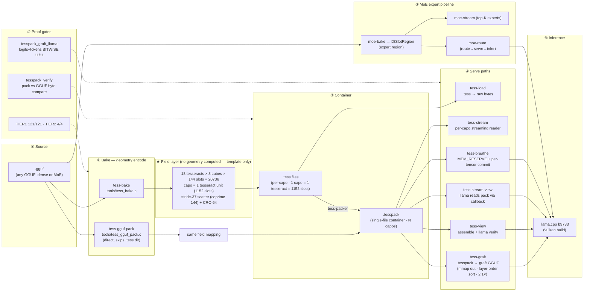
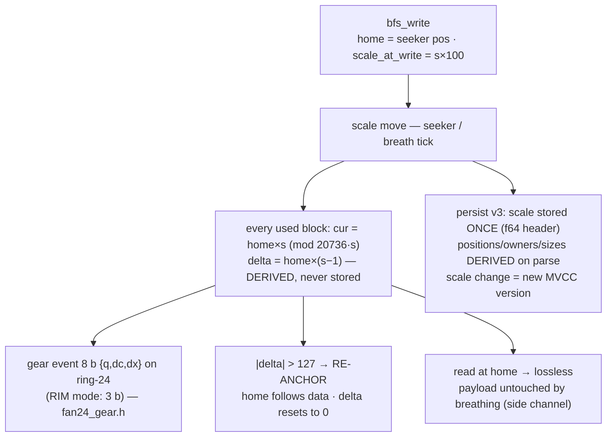

# PIPELINE-MAP — DWGLS .tesspack / MoE system (2026-09-05)

> Map of every stage: what runs, what it reads/writes, and where the proof lives.
> All stages proven lossless (decode → compare every value at every position).
>
> Naming rule: this map uses **generic placeholders** (`<model>.gguf`, `<model>.tesspack`).
> Machine-local paths live only in Makefile vars (`LLAMA_GGUF`, `MOE_GGUF`) — never here.

> **SVG renders:** `docs/pipeline-map.svg` (big picture) · `docs/scale-bridge.svg` (BFS⇄tess scale bridge)

## 1. Big picture (mermaid)



## 2. ASCII map (fallback)

```
<model>.gguf
   │
   ├─ tess-bake ──────► .tess files (capo each: 1152 slots, stride-37 scatter, CRC-64)
   │                        │
   │                        └─ tess-packer ──► <model>.tesspack (single-file container)
   ├─ tess-gguf-pack ───────────────────────────► <model>.tesspack (direct)
   │
   ▼  field template (never computed, only addressed):
      18 tes × 8 cube × 144 slots = 20736   ·  capo = 1 tesseract = 1152
      cube0 = index frame (base/len/stride/checksum) · cube1..7 = data
      KIS timeline: enter ANYWHERE · forward=expand · backward=contract
   │
   ├─ tess-load      .tess ──► raw bytes ─────────────── (roundtrip test)
   ├─ tess-stream    per-capo reader (93.8% bandwidth saved)
   ├─ tess-graft     .tesspack ──► graft GGUF (mmap, layer-order) ──► llama.cpp
   ├─ tess-view      .tesspack ──► assemble ──► llama.cpp verify
   ├─ tess-stream-view  llama pulls tensors from pack (callback, no graft file)
   ├─ tess-breathe   MEM_RESERVE + per-tensor MEM_COMMIT (window RSS proof)
   │
   └─ moe-bake ──► DtSlotRegion ──► moe-stream (top-K) / moe-route ──► llama.cpp

PROOF GATES:  make test (TIER1+TIER2) · tesspack_verify (pack vs GGUF)
              tesspack-graft-llama (logits+tokens BITWISE) · tess-roundtrip
```

## 3. Per-step table

| # | Stage | Tool (make target) | Input → Output | Proof |
|---|-------|--------------------|----------------|-------|
| ① | source | — | `<model>.gguf` | — |
| ② | bake | `tess-bake` (`tools/tess_bake.c`) | GGUF → `tess_out/*.tess` | bitwise identical to source |
| ②′ | direct pack | `tess-gguf-pack` (`tools/tess_gguf_pack.c`) | GGUF → `.tesspack` | same mapping, skips .tess dir |
| ③ | pack | `tess-packer` (`tools/tess_packer.c`) | `.tess` dir → `<model>.tesspack` | `test_tesspack` (TIER1) |
| ④ | stream | `tess-stream` (`tools/tess_load_stream.c`) | pack → per-capo tensors | `test_tess_stream`, 93.8% bandwidth saved |
| ④′ | graft | `tess-graft` (`tools/tesspack_graft.c`) | pack → graft GGUF | 11/11 BITWISE logits+tokens, 52 s → ~25 s (2.1×) |
| ④″ | view / breathe | `tess-view`, `tess-breathe` | pack → assemble → llama / mmap RSS | `tesspack_llama_report`, 48 MB RSS proof |
| ⑤ | MoE | `moe-bake/moe-stream/moe-route` | GGUF → DtSlotRegion → top-K experts | `test_moe_expert` (TIER1) |
| ⑥ | inference | llama.cpp b9733 vulkan | graft/view GGUF → generation | `tesspack-graft-llama` 11/11 PASS |
| ⑦ | verify | `tools/tesspack_verify.c` | pack vs original GGUF, byte-compare | **2026-09-05: 44,319/434 capos, 0 failed** |

## 4. Field addressing rules (invariants — do not violate)

- `20736 = 144² = 1728×12 = 18 tes × 8 cube × 144` — the only window used.
- **MAP not COMPRESS**: coordinate = address; no hash, no lookup for weight mapping.
- scatter stride must be **coprime with 144** (stride-37 default); cube 0 = index frame.
- scale = constant magnification `s(t)=s₀·kᵗ`; global scale, append needs no scale tag.
- int-only, static LUT, modular arithmetic. **No vertex/face/projection computation.**

## 5. BFS scale layer — how & when it moves the system

Same doctrine as the KIS rescope: **scale = one global magnification `s(t)`** — and because a
position at any scale is a **pure function of the anchor**, the system never stores per-block
scale state. Scale movement is metadata; payloads never move.

### The one formula (bfs_seek_anchor.h)

```
current(s) = home × s  (mod 20736·s)
delta(s)   = current(s) − home = home × (s − 1)     ← derived at read, O(1)
```

Anchor = `(home_pos, scale_at_write)` = **5 B/block** vs ~1 KB stored delta log → **~200× less**
scale state. Reading at the wrong scale doesn't break anything: delta is recomputed, and
decode is defined at home (delta=0) — lossless at every anchor.



### Trigger table — when scale acts and what it costs

| When (trigger) | Module | Effect on system | Cost |
|---|---|---|---|
| write block | `breathing_fs.h bfs_write` | `home_pos` = seeker position; `scale_at_write` = s×100 (u8) | O(1)/block |
| **scale move** `bfs_move_seeker` | `breathing_fs.h` | **all** used blocks: `cur = home×s mod space`; delta recomputed; gear event pushed; glass flag set | O(144) per move — all blocks shift together (global scale) |
| **breath tick** `bfs_breath_tick` | `bfs_breath.h` | scale oscillates 1.0 ⇄ `step` (default 0.05); if \|delta\| > 127 → re-anchor → delta layer stays **int8 forever** (4× smaller than int32) | O(144)/tick, bounded 1 B/block |
| read (plain/mmap) | `bfs_read`, `bfs_mmap_read` | lossless at home; breathing never touches payloads — compression is a **side channel** | zero-copy on mmap |
| save/load image v3 | `bfs_persist.h` | scale in header (f64@24) once; current/delta/owners/sizes derived on parse | smaller image, nothing stored twice |
| snapshot/restore (MVCC) | `bfs_persist.h` | **scale change = new timeline version**; snapshot captures seeker + per-block pos/delta | O(144) copy, ≤8 versions |
| scale < 1 (hyperbolic) | `seeker_scale` | `space = 20736·s` shrinks, `window = 5184/s` grows; `window > space` ⇒ **[HYPERBOLIC]** address-space fold | floor s ≥ 1e-6 (stability fix) |
| magnifier glass | `bfs_magnify.h` | middle half of 144 cells = glass; rates 5/7 inside, 29/103 outside; **a_w × a_(w+72) ≡ 1 (mod 144)** | O(1) |
| CPU↔GPU sync | `geo_bfs_hub.h` | gear-lock sync source = **live header scale byte** of the mapped image | 1 byte |

### Gear wire — the scale-change log (shared with the KIS side)

- ring-24 = 8 teeth (KIS cube wheel) × 3 teeth (hyper axis wheel), gcd=1 → **CRT bijection on Z24**;
  Δ = (to−from) mod 144 = 24q + r, each side reads only its own remainder.
- Event = 8 bits `{q:3, dc:3, dx:2}`; **RIM mode** (all Δ ≡ 0 mod 24) = 3 bits — 50%+ saving vs the old 16-bit `{from,to}` log.
- **Enter anywhere**: the log stores Δ only — no absolute seed. The reader holds its own `cur_w`
  and walks backward (`fg_reconstruct`) → lossless from any entry point (KIS doctrine, fan24_gear.h).
- Same wire on the tess side: `test_tess_scale_log_gear`, `test_ghost_gear_adapter`
  (ghost-lift entries = the 5 B `(block_id, from_scale, to_scale)` scale-route log).

### Where BFS scale sits vs the .tesspack pipeline

Two instantiations of the same scale timeline:

| | BFS (BreathingFS) | .tesspack pipeline |
|---|---|---|
| scale axis | continuous s ∈ [1e-6, 1.0] (seeker) | discrete W ∈ [0,144) (tess scale log / ghost lift) |
| movement log | fan24 gear events in `BreathingFS.fg_log` | passive scale-change log (hyperbolic side) |
| reading rule | lossless at home; delta derived | read at correct scale → empty log; wrong scale → replay log |
| memory behavior | window = 5184/s scopes address space | mmap window follows the layer pointer (`scale-follow` proof) |

Proofs: `test_bfs_persist`, `test_bfs_stability`, `test_bfs_seek_anchor`, `test_bfs_breath`,
`test_geo_bfs_hub` (all TIER1 PASS) · `test_tess_magnify` (glass) · `test_tess_scale_log`,
`test_tess_scale_log_gear`, `test_tess_scale_dedup` (scale log) · `make scale-follow` (window memory).

### The bridge — one shared timeline (core/scale_bridge.h, added 2026-09-05)

The two layers above run on **one scale timeline**: 1 gear tooth = 1 semitone = ×2^(1/12).

```
tooth = 1 semitone = ×2^(1/12)     teeth(s) = −12·log2(s)     s(W) = 2^(−W/12)     W = teeth mod 144
```

| Alignment | Value | Meaning |
|---|---|---|
| W=0 | s = 1.0 | home — gear home tooth (Δ=0 emits nothing) |
| W=12 | s = 0.5 | **exact** BFS hyperbolic boundary (window=space ⇔ s²=¼); hyper ⇔ W&gt;12 |
| Δ=12 | ×2 | one octave — base-2, timeline-first |
| Δ=24 (rim, q=1) | ×4 | one full fan24 rim turn |
| ring 144 | ×4096 | 12 octaves = 4⁶ — one full wrap |
| BFS floor 1e-6 | → W=95 | teeth 239.18 → round 239 → 239 mod 144 (deep wrap, ∞ side) |
| expansion s=2 | → W=132 | teeth −12 mod 144 |

- Named window W∈[0,144) covers s ∈ [2^(−143/12), 1] ≈ [2.06e-4, 1]; deeper scales **wrap the ring**
  (doctrine: ∞ ← contraction ← 0 ← expansion → ∞, enter anywhere).
- W→s exact bijection; s→W nearest-tooth (error ≤ 2^(±1/24) ≈ ±2.9%); grid roundtrip exact.
- Zero hash, zero lookup, zero malloc — pure math (`scale_bridge.h`, ~80 lines).
- Proof: `tests/test_scale_bridge.c` **35/35 PASS** — math-oracle tests, real-BFS integration
  (deltas at s(12) == manual oracle, lossless after excursion), gear wire Δ=12 octave identity,
  and deep-scale BIMG **save/load disk roundtrip**; mutation-checked (rate 12→24 ⇒ 8 red).

## 6. System check — 2026-09-05 (this session)

| Check | Result |
|-------|--------|
| `make tier1` | **122/122 PASS** — 121 prior + new `test_scale_bridge` (up from 118/121 baseline) |
| `make tier2` | **4/4 PASS** |
| `tesspack_verify` on real 2.87 GB pack | **44,319 capos matched, 0 failed, 0 skipped** |
| `beam_cost_probe` on real Q8_0 model | works; NET **−11.3 b/block** full-permutation (confirms why beam was killed; Octagram D4 constraint claims +57 b) |
| `test_scale_follow` build | was broken (missing `-lpsapi`, `%zu`/`%u` on mingw) — **fixed** |
| `test_scale_follow` random phase | was unbounded (>600 s on cold HDD) — **fixed**: `--sample N` (default 8192) + `--time S` (default 60 s) caps, deterministic xorshift64; `--full` restores the exhaustive sweep |
| `verify_octagram_beam.c` | **missing from repo** — referenced by `docs/DISCOVERY-octagram-mathematical-foundation.md` (38/38 PASS claim); recover from session dir or re-add |
